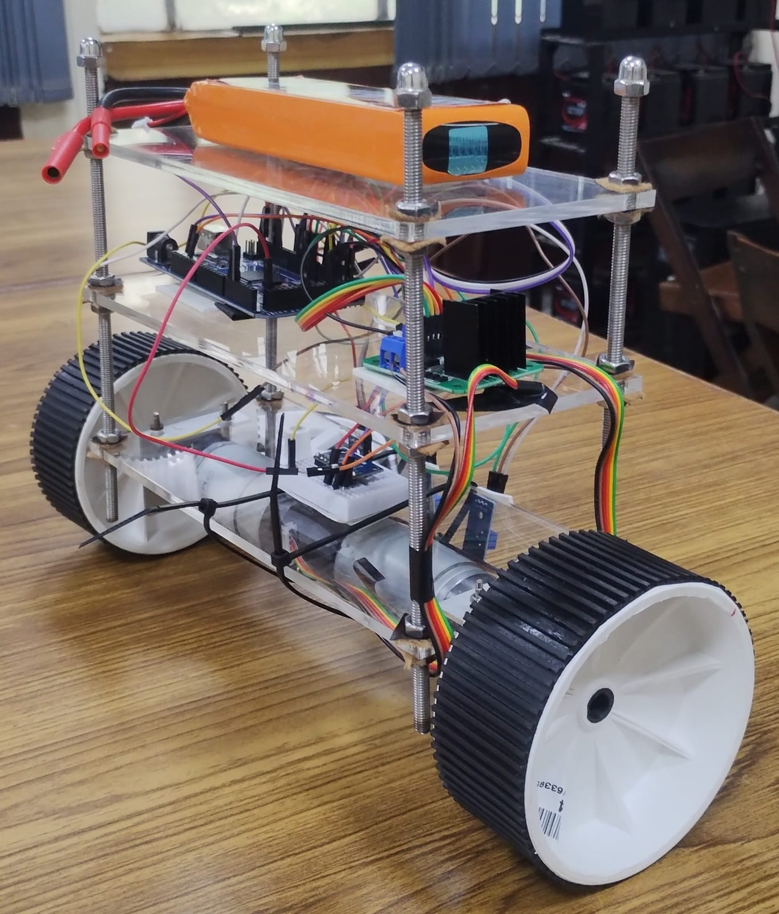
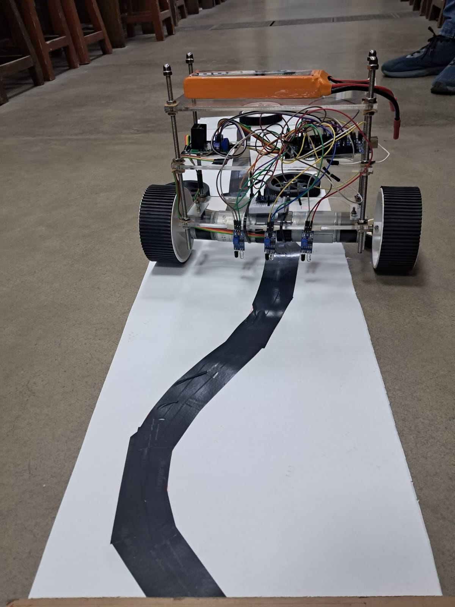

# BalancingBot__

Self-balancing robots, often resembling miniature Segways, are a fascinat-
ing blend of engineering and autonomy. What makes them stand out is
their ability to stay upright on just two wheel, mimicking how humans
balance while walking. This seemingly simple feat has opened doors to
a wide range of real world applications. From personal mobility devices
like hover boards and electric scooters to smart delivery robots navigat-
ing crowded streets, the core technology behind self balancing systems
is increasingly shaping modern transportation and automation. They are
also used in camera stabilization rigs, agile warehouse bots, and even assis-
tive robots for the elderly, where smooth, controlled motion is essential. By
mastering balance, these robots unlock safe, compact, and highly manoeu-
vrable solutions in environments where traditional four wheeled designs fall
short.

## Objective
• To derive the non linear mathematical model of the two wheeled self
balancing robot.

• To linearize the system dynamics around the upright equilibrium about
0° tilt angle.

• To design and tune a PID controller based on the linearized model.

• To validate system behaviour through simulation in MATLAB.

• To integrate IR based path following functionality into the balancing
platform.

